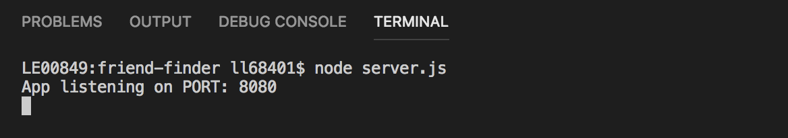

# Full Stack Node + Express 'Friend Finder' app

## Getting Started
In order to use this app:
* Clone repo to you machine
* `npm install` all required dependencies:
    * https://www.npmjs.com/package/express
    * https://www.npmjs.com/package/path
* Start the app by running the following in your Terminal command line: `node server.js` — you should get the message "App listening on PORT: 8080" 

* Type `localhost:8080` into the address bar in your browser
* Enjoy!

----

## Demo

1. Welcome to the home page! Click the "Go to Survey" button to begin

---

2. Fill out the survey — your name and a URL to your picture are required (just grab an image from Google Images if you'd like). There are 10 questions that all need to be answered as well.

---

3. Once all questions have been answered, click the "Submit" button to meet your new Buddy!

---

4. A modal pops up displaying your Buddy who is a closest match to the total score of your survey responses (out of 50). 

